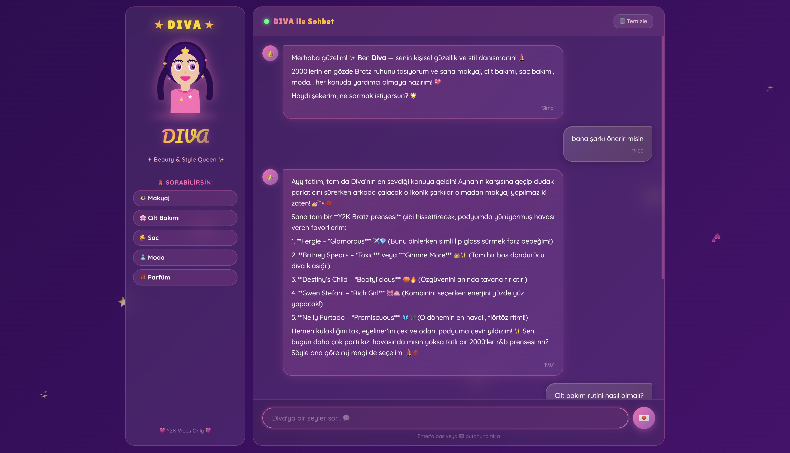

# 💖 DIVA — Y2K Beauty & Style Chatbot

> 2000'lerin Bratz bebek ruhundan ilham alan, makyaj, cilt bakımı, saç, moda ve stil konularında Türkçe tavsiyeler veren yapay zeka destekli chatbot. ✨



---

## 🌟 Özellikler

- 💄 Makyaj, cilt bakımı, saç & moda tavsiyeleri
- 👑 Y2K / Bratz estetiğinde tasarım (mor, pembe, holografik)
- 🦋 Gemini AI destekli çok turlu sohbet (chat history)
- ✨ Animasyonlu sparkle efektleri, glassmorphism balonlar
- 📱 Responsive tasarım
- ⚡ FastAPI backend + saf HTML/CSS/JS frontend

---

## 🛠️ Teknoloji Yığını

| Katman    | Teknoloji                         |
|-----------|-----------------------------------|
| Backend   | Python 3.10+, FastAPI, Uvicorn    |
| AI Model  | Google Gemini 3.8 Flash           |
| Frontend  | HTML5, CSS3 (Vanilla), JavaScript |
| Env       | python-dotenv                     |

---

## 🚀 Kurulum

### 1. Repoyu Klonla

```bash
git clone https://github.com/kullanici-adin/diva-chatbot.git
cd diva-chatbot
```

### 2. Sanal Ortam Oluştur & Bağımlılıkları Yükle

```bash
python -m venv .venv
source .venv/bin/activate   # Windows: .venv\Scripts\activate
pip install -r requirements.txt
```

### 3. Gemini API Key Al

1. [Google AI Studio](https://aistudio.google.com/app/apikey) adresine git
2. **"Create API Key"** butonuna tıkla
3. Oluşturulan key'i kopyala

### 4. `.env` Dosyasını Oluştur

Projenin ana dizininde **`.env`** adında bir dosya oluştur (`.env.example`'dan kopyalayabilirsin):

```bash
cp .env.example .env
```

Ardından `.env` dosyasını aç ve kendi API key'ini yapıştır:

```env
GEMINI_API_KEY=buraya_kendi_api_keyini_yaz
```

> **⚠️ Önemli:**
> - API key'ini `.env` dosyasına koy — `.env.example` dosyasına değil.
> - `.env` dosyası `.gitignore`'a eklenmiştir, GitHub'a yüklenmez.
> - `.env.example` dosyası şablon olarak repo'da tutulur, asıl key **asla** buraya yazılmaz.

### 5. Sunucuyu Başlat

```bash
uvicorn main:app --port 8000 --reload
```

Ardından tarayıcında aç: **[http://localhost:8000](http://localhost:8000)** 💖

---

## 📁 Proje Yapısı

```
diva-chatbot/
├── main.py              ← FastAPI uygulama & Gemini entegrasyonu
├── requirements.txt     ← Python bağımlılıkları
├── .env                 ← API key (Git'e gönderilmez!)
├── .env.example         ← Şablon — key yok, güvenle paylaşılır
├── chatbot.png          ← Uygulama önizleme görseli
└── static/
    ├── index.html       ← Y2K Bratz arayüzü
    ├── style.css        ← Animasyonlar, tema, glassmorphism
    └── app.js           ← Sohbet mantığı, fetch, hata yönetimi
```

---

## 💅 Free Tier Notu

Google Gemini API free tier kullanımında dakika başına istek limiti vardır. Limit aşıldığında Diva seni nazikçe uyarır — birkaç dakika bekleyip tekrar dene! ✨

---

## 🎀 Ekran Görüntüsü


---

<p align="center">Made with 💖 & Y2K vibes</p>
